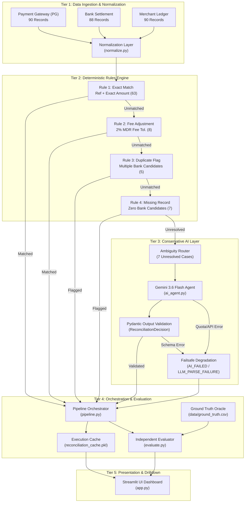

# ReconAI: System Architecture & Technical Specification

## 1. High-Level Architecture Overview

ReconAI follows a decoupled, multi-tier financial controller design pattern. It enforces strict separation between high-confidence rule execution and intelligent generative exception analysis:



---

## 2. Component Breakdown

### Tier 1: Multi-Source Normalization Layer (`normalize.py`)
- **`clean_amount(val)`**: Strips currency symbols (`₹`, `$`, `INR`), thousands separators, whitespace, and casts to `round(float(val), 2)` to avoid IEEE 754 precision drift.
- **`normalize_date(val)`**: Converts dates from multiple heterogeneous formats (`YYYY-MM-DD`, `DD/MM/YYYY`, `MM-DD-YYYY`) into standard Python `datetime.date` objects.
- **`normalize_reference(val)`**: Converts references to uppercase alphanumeric strings, stripping prefixes like `REF:`, `TXN-`, or clearing noise.

### Tier 2: Deterministic Rules Engine (`match_rules.py`)
The rules engine evaluates each Payment record sequentially:
1. **Rule 1: Exact Match**
   - Condition: Normalized Payment Reference == Normalized Bank Reference AND `abs(payment_amount - settlement_amount) <= 0.01`.
   - Result: `MATCH` (`MATCHED_BY_RULE`, confidence `1.0`).
2. **Rule 2: Gateway Fee Adjustment**
   - Condition: Bank settlement occurs within `[T+0, T+3]` days AND `abs((payment_amount * 0.98) - settlement_amount) <= 0.50`.
   - Result: `MATCH` (`MATCHED_WITH_FEE`, confidence `0.95`).
3. **Rule 3: Duplicate Candidate Detection**
   - Condition: Multiple bank records match reference or customer within the settlement window.
   - Result: `EXCEPTION` (`DUPLICATE_SETTLEMENT`, method `DUPLICATE_CANDIDATE`, confidence `0.90`).
   - *Design rationale:* Never arbitrarily pick one candidate when multiple records exist.
4. **Rule 4: Missing Record Detection**
   - Condition: Exactly 0 bank candidate records exist in the entire settlement window `[T+0, T+3]`.
   - Result: `EXCEPTION` (`MISSING_RECORD`, method `NO_BANK_RECORD`, confidence `0.95`).

### Tier 3: Conservative AI Layer (`ai_agent.py`)
- Only receives cases classified as `UNRESOLVED` by the rules engine.
- **Model:** `gemini-3.6-flash` via the official `@google/genai` SDK (`google-genai`).
- **Input Context:** Comprehensive 3-way reconciliation dossier including Payment Gateway attributes, Ledger details, and all identified Bank Candidates.
- **Output Enforcement:** Strict Pydantic model (`ReconciliationDecision`).
- **Fail-Safe Mechanism:**
  ```python
  except Exception as e:
      logger.error(f"Gemini API failure for {transaction_id}: {e}")
      return ReconciliationDecision(
          transaction_id=transaction_id,
          decision="EXCEPTION",
          matched_bank_id=None,
          exception_type="LLM_PARSE_FAILURE",
          confidence_score=0.0,
          reasoning=f"AI resolution failed: {type(e).__name__} - {str(e)}",
          suggested_action="Manual controller review required."
      ), "AI_FAILED"
  ```

### Tier 4: Pipeline Orchestration & Evaluation (`pipeline.py`, `evaluate.py`)
- **`pipeline.py`**: Coordinates data ingestion, rules processing, batch AI resolution with rate-limiting backoff (3.5s delay), and result consolidation.
- **`evaluate.py`**: Compares final predictions against `data/ground_truth.csv`. Calculates:
  - Binary decision metrics (TP, TN, FP, FN, Accuracy, Precision, Recall).
  - Business exception classification metrics (per-category Precision, Recall, F1).
  - System failure metrics (`LLM_PARSE_FAILURE` / `AI_FAILED` tracked distinctly from business exceptions).

### Tier 5: Streamlit Interactive Dashboard (`app.py`)
- Provides a real-time, zero-API-cost interface powered by `data/reconciliation_cache.pkl`.
- Features 9 executive summary KPI cards, an AI health alert banner, breakdown charts, ground-truth confusion matrix, and 3-way transaction drilldown.

---

## 3. Data Flow & State Transitions

Each transaction in ReconAI follows an unambiguous state progression:

```
[Raw Payment]
     │
     ▼
[Normalized]
     │
     ├───► Exact / Fee Match ─────────────► [MATCH] (Final)
     │
     ├───► Duplicate / Missing Bank ──────► [EXCEPTION] (Final)
     │
     └───► Ambiguous (Unresolved)
                │
                ▼
         [AI Escalation]
                │
                ├───► Gemini Decides MATCH ─────► [MATCH] (Final)
                │
                ├───► Gemini Decides EXCEPTION ─► [EXCEPTION] (Final)
                │
                └───► API/Quota/Schema Failure ──► [EXCEPTION: AI_FAILED] (Final)
```

At no point can a system failure accidentally resolve an exception into a match.

---

## 4. Security & Safety Design

1. **Zero Secret Exposure:**
   - `.env` is git-ignored and never committed.
   - API keys are read via `os.getenv("GEMINI_API_KEY")` and never logged, printed, or sent to client browsers.
2. **Oracle Isolation:**
   - `data/ground_truth.csv` is strictly read by `evaluate.py` as an evaluation benchmark. It is never imported or referenced by `normalize.py`, `match_rules.py`, `ai_agent.py`, or `pipeline.py`.
3. **Controlled Quota Consumption:**
   - Dashboard interactions read from local cache (`data/reconciliation_cache.pkl`) by default, preventing unintended API calls and conserving quota.
