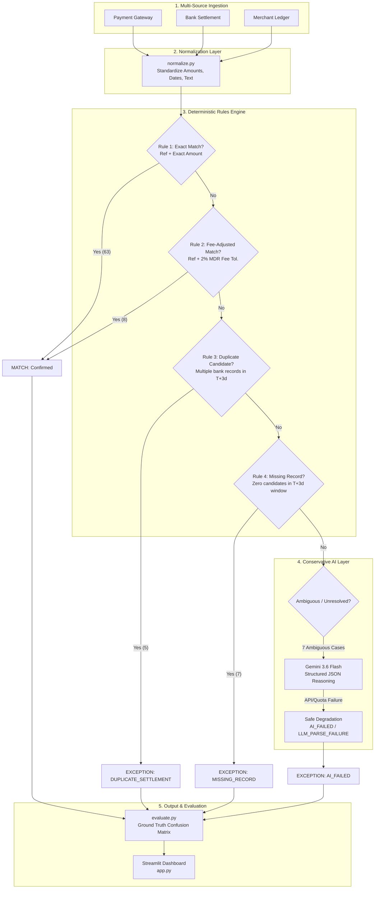

# ReconAI: Multi-Source Financial Reconciliation Agent

[](https://razorpay.com)
[](https://www.python.org/)
[](https://streamlit.io/)
[](https://deepmind.google/technologies/gemini/)

> **Solo Submission** — Razorpay AI Buildathon (Track 04: AI Finance Controller)

---

## 1. Project Overview

### The Problem: Financial Reconciliation at Scale
In modern fintech and e-commerce enterprises, high-volume transactional flows span multiple disjointed systems:
1. **Payment Gateways (PG):** Capture authorizations, payment intents, customer IDs, and reference numbers.
2. **Bank Settlement Statements:** Reflect actual batch-settled funds, net of MDR fees, often delayed by 1–3 settlement days and formatted with cryptic bank descriptors.
3. **Merchant Internal Ledgers:** Record order-level accounting entries, fulfillment timestamps, and internal invoices.

Discrepancies inevitably arise due to:
- **T+N Settlement Windows:** Delays between customer payment and bank credit.
- **Gateway Deduction Fees:** Unbundled MDR fees (e.g., 2% fee deduction causing amount variance).
- **Duplicate Settlements:** Duplicate batch transmissions or double-captured transactions.
- **Missing Settlement Records:** Bank drops, delayed merchant transfers, or dropped settlement files.
- **Fuzzy Descriptors & Text Noise:** Reference strings truncated or mangled by intermediary clearing systems.

Manual reconciliation is slow, expensive, and error-prone. Traditional rule engines either leave too many unmatched items for humans to review or use loose fuzzy matching that creates catastrophic false positives.

### What is ReconAI?
**ReconAI** is an autonomous, conservative 3-way financial reconciliation engine built on an enterprise controller philosophy:
- **Deterministic First:** High-confidence cases are matched strictly through verifiable, auditable financial rules.
- **Selective AI Escalation:** Only genuinely ambiguous edge cases (e.g., conflicting candidates, non-standard fee structures, text variations) are escalated to Google Gemini (`gemini-3.6-flash`).
- **Zero False-Positive Integrity:** Financial controllers prefer an unverified transaction to be flagged as an `EXCEPTION` rather than forced into a false `MATCH`.
- **Transparent Failsafe Degradation:** If external AI services face rate limits, network timeouts, or schema errors, ReconAI automatically degrades cases to `AI_FAILED` (`LLM_PARSE_FAILURE`) and maintains exception status without pipeline interruption.

---

## 2. How ReconAI Works

ReconAI reconciles transactions across a multi-stage deterministic and AI pipeline:



### Pipeline Stages

1. **Multi-Source Ingestion & Data Hygiene:**
   - Ingests Payment Gateway records, Bank settlement files, and Merchant Ledgers.
   - Cleanses amount floats to avoid floating-point inaccuracies, parses diverse date strings into standardized `YYYY-MM-DD` objects, and strips punctuation, noise, and whitespace from payment references.

2. **Deterministic Matching Rules (`match_rules.py`):**
   - **Rule 1 — Exact Reference & Amount Match:** Normalized reference strings match exactly and settlement amounts align within ₹0.01.
   - **Rule 2 — Gateway Fee Adjustment:** Identifies net settlements where the bank received an amount minus a standard 2.0% gateway fee (within ₹0.50 tolerance) within the 3-day settlement window.
   - **Rule 3 — Multi-Candidate Duplicate Detection:** Detects whether multiple plausible settlement records exist for the same transaction within the settlement window. Rather than guessing or picking the first candidate, it proactively flags `DUPLICATE_SETTLEMENT`.
   - **Rule 4 — Missing Record Detection:** If zero plausible bank candidates exist anywhere within the T+0 to T+3 settlement window, it classifies the transaction as `MISSING_RECORD`.

3. **Selective AI Escalation (`ai_agent.py`):**
   - Only cases that fail Rules 1–4 are escalated to Gemini AI. Already-resolved transactions are never sent to external LLMs.
   - Prompts include 3-way record context (Payment, Bank candidate list, Ledger entry).
   - Enforces a conservative system prompt: never force a match without strong multi-source evidence.

4. **Fail-Safe Degradation:**
   - If the LLM call times out, returns malformed JSON, fails Pydantic schema validation, or encounters API rate limits (`429 RESOURCE_EXHAUSTED`), the pipeline safely assigns:
     - `decision`: `EXCEPTION`
     - `exception_type`: `LLM_PARSE_FAILURE`
     - `resolution_method`: `AI_FAILED`
     - `confidence_score`: `0.0`
   - The pipeline continues smoothly without crashing.

---

## 3. Architecture & Data Flow

ReconAI maintains a strict separation of concerns across five decoupled components:

```
┌────────────────────────────────────────────────────────────────────────────────────────┐
│                                  ReconAI Architecture                                 │
└────────────────────────────────────────────────────────────────────────────────────────┘

 [Data Sources]         payments.csv         bank.csv           ledger.csv
                              │                  │                  │
                              ▼                  ▼                  ▼
 [Normalization]         clean_amount()   normalize_date()   normalize_reference()
                                                │
                                                ▼
 [Rules Engine]       Deterministic Rules (match_rules.py)
                      ├── Rule 1: Exact Match (63)
                      ├── Rule 2: Fee-Adjusted Match (8)
                      ├── Rule 3: Duplicate Candidate Flag (5)
                      └── Rule 4: Missing Bank Record (7)
                                                │
                                                ▼ (7 Unresolved Cases Only)
 [AI Escalation]      Gemini AI Agent (ai_agent.py)
                      ├── Model: gemini-3.6-flash
                      ├── Structured Output: Pydantic ReconciliationDecision
                      └── Fallback Handler: Catch 429/500/Malformed -> AI_FAILED
                                                │
                                                ▼
 [Orchestration]      pipeline.py -> Unified Reconciliation Output (90 records)
                                                │
                                                ▼
 [Evaluation & UI]    evaluate.py (Confusion Matrix & Accuracy)
                      app.py (Streamlit Interactive Dashboard)
```

---

## 4. The AI Layer: Design & Controls

### Principles of Conservative AI Reconciliation
Financial ledgers do not tolerate "hallucinated matches." ReconAI treats the LLM not as a creative writer, but as a specialized auditor:

1. **Structured Outputs with Pydantic:**
   Every Gemini response is strictly parsed against a rigorous Pydantic schema:
   ```python
   class ReconciliationDecision(BaseModel):
       transaction_id: str
       decision: Literal["MATCH", "EXCEPTION"]
       matched_bank_id: Optional[str]
       exception_type: Optional[Literal[
           "AMOUNT_MISMATCH",
           "DUPLICATE_SETTLEMENT",
           "MISSING_RECORD",
           "UNEXPLAINED",
           "LLM_PARSE_FAILURE"
       ]]
       confidence_score: float = Field(ge=0.0, le=1.0)
       reasoning: str
       suggested_action: str
   ```

2. **Boundary Enforcement:**
   - The prompt explicitly instructs Gemini: *"You are an enterprise financial controller. Never force a MATCH when amounts or references cannot be plausibly explained. Prefer EXCEPTION over MATCH when uncertain."*
   - Strict field dependency validation: If Gemini returns `decision="MATCH"`, `matched_bank_id` must be present and `exception_type` must be null.

3. **Graceful Degradation:**
   AI failures never cause false matches. If external API communication fails, the transaction is marked as an `EXCEPTION` with `resolution_method="AI_FAILED"`.

---

## 5. Evaluation & Final Validation Run

Evaluation is conducted independently by `evaluate.py` against `data/ground_truth.csv`. The ground-truth oracle is strictly isolated and never accessed by matching rules, normalization, or AI prompts.

### Current Final Validation Run Results (90 Transactions)

| Dimension | Metric | Count / Percentage | Details |
|---|---|---|---|
| **Volume** | Total Processed | **90** | 100% of dataset evaluated |
| **Deterministic Layer** | Exact Rule Matches | **63** | Matched via Rule 1 |
| | Fee-Adjusted Matches | **8** | Matched via Rule 2 (2% fee deduction) |
| | **Total Deterministic Matches** | **71** | **78.89%** of all transactions |
| **Rule Exceptions** | Duplicate Settlements | **5** | Identified multiple candidate bank records |
| | Missing Bank Records | **7** | Confirmed 0 bank records in T+3d window |
| | **Total Rule Exceptions** | **12** | **13.33%** of all transactions |
| **AI Escalation Layer** | Ambiguous Cases Escalated | **7** | Sent to Gemini (`gemini-3.6-flash`) |
| | AI Successful Resolutions | **0** | Daily quota exhausted in final validation |
| | AI / System Failures | **7** | Safely degraded to `AI_FAILED` (`LLM_PARSE_FAILURE`) |

### Binary Decision Confusion Matrix

```
                      Predicted MATCH    Predicted EXCEPTION
Actual MATCH                71 (TP)             0 (FN)
Actual EXCEPTION             0 (FP)            19 (TN)
```

- **Binary Decision Accuracy:** **100.00%**
- **False Positive Rate (FPR):** **0.00%** (0 false matches out of 19 true exceptions)
- **False Negative Rate (FNR):** **0.00%** (0 false exceptions out of 71 true matches)
- **Specificity:** **100.00%**
- **Sensitivity / Recall:** **100.00%**

> [!IMPORTANT]  
> **Evaluation Distinction:** The 100.00% binary decision accuracy reflects the overall end-to-end controller performance (deterministic rules + safe exception degradation). It is **not** an "AI accuracy" metric. In the final validation run, Gemini's daily quota was exhausted, so all 7 AI cases safely fell back to `EXCEPTION`.

### Business Exception-Type Metrics

| Exception Category | Actual Count | Predicted Count | Precision | Recall | F1-Score |
|---|---|---|---|---|---|
| **DUPLICATE_SETTLEMENT** | 5 | 5 | **100.00%** | **100.00%** | **1.000** |
| **MISSING_RECORD** | 7 | 7 | **100.00%** | **100.00%** | **1.000** |
| **AMOUNT_MISMATCH** | 7 | 0* | 0.00%* | 0.00%* | 0.000* |
| **UNEXPLAINED** | 0 | 0 | **N/A** | **N/A** | **N/A** |

*\*Note: In the final quota-limited run, the 7 actual amount-mismatch cases were escalated to AI and safely classified as system exceptions (`LLM_PARSE_FAILURE` / `AI_FAILED`). Because system failures are tracked distinctly from business exceptions, business classification precision for amount mismatches reflects 0 predictions in this run.*

---

## 6. Important AI Validation Disclosure

> **Official Validation Note:**  
> During earlier Phase 3 development validation, Google Gemini (`gemini-3.6-flash`) was tested live against the Gemini API and successfully produced genuine, verified structured reasoning for ambiguous reconciliation cases (resolving fuzzy references and identifying subtle amount variations).  
>
> In the final full 90-transaction validation run, the Gemini free-tier daily project quota was exhausted before the 7 AI-escalated cases could be processed. ReconAI's built-in fail-safe mechanism caught the `429 RESOURCE_EXHAUSTED` errors and recorded those cases as `AI_FAILED` (`LLM_PARSE_FAILURE`), safely leaving them as exceptions rather than force-matching them.  
>
> The final run transparently reflects this system behavior and does **not** claim those 7 cases were successfully AI-resolved.

---

## 7. Issues Encountered & Engineering Resolutions

During the design and validation of ReconAI, three real-world engineering issues were encountered and resolved:

1. **UTF-8 BOM File Encoding Issue (`app.py`):**
   - *Issue:* An initial file-write operation created a UTF-8 Byte Order Mark (`\ufeff`) at line 1, causing Python syntax errors.
   - *Resolution:* Inspected the raw binary stream, stripped the BOM character, and standardized all file saves to clean UTF-8.
2. **Gemini Model Deprecation & Compatibility:**
   - *Issue:* Initial requests specifying `gemini-2.5-flash` received API `404 Not Found` errors due to Google model deprecation for new API keys.
   - *Resolution:* Upgraded to Google's current `gemini-3.6-flash` model, verified live token responses, and created an explicit fallback notification architecture without silent model rewriting.
3. **Gemini Free-Tier Rate & Daily Quota Caps (`429 RESOURCE_EXHAUSTED`):**
   - *Issue:* Google Gemini's free tier imposes a strict daily cap of 20 requests per day per project (`GenerateRequestsPerDayPerProjectPerModel-FreeTier`). After processing batch development runs, subsequent calls were throttled.
   - *Resolution:* Tested and verified the system's graceful degradation path. Instead of halting or throwing an unhandled exception, ReconAI recorded the error context, classified the 7 transactions as `AI_FAILED` (`LLM_PARSE_FAILURE`), preserved zero false-positive integrity, and serialized the verified run into `data/reconciliation_cache.pkl` for instantaneous dashboard rendering.

---

## 8. Project Structure

```
reconAI/
├── .env.example              # Template configuration file (API key placeholder)
├── .gitignore                # Git exclusions (.env, caches, virtualenvs)
├── requirements.txt          # Python dependencies
├── generate_data.py          # Synthetic dataset generator (90 PG, 88 Bank, 90 Ledger)
├── normalize.py              # Cleaning, date parsing, reference stripping functions
├── match_rules.py            # Deterministic reconciliation rules (Rules 1-4)
├── ai_agent.py               # Google Gemini client, Pydantic schema, structured output
├── evaluate.py               # Standalone ground-truth evaluation & confusion matrix
├── pipeline.py               # End-to-end orchestration pipeline
├── app.py                    # Streamlit interactive reconciliation dashboard
├── ARCHITECTURE.md           # Deep-dive architecture & data flow specification
├── DEMO_SCRIPT.md            # Spoken 2-3 minute presentation & demonstration script
├── SUBMISSION_CHECKLIST.md   # Final hackathon submission audit checklist
├── data/
│   ├── payments.csv          # Payment Gateway records (90 rows)
│   ├── bank.csv              # Bank Settlement statements (88 rows)
│   ├── ledger.csv            # Merchant Internal Ledger entries (90 rows)
│   ├── ground_truth.csv      # Independent test oracle (90 rows)
│   └── reconciliation_cache.pkl # Verified pipeline execution output cache
└── docs/                     # Additional documentation assets
```

---

## 9. Setup & Installation Instructions

### Prerequisites
- Python 3.10, 3.11, or 3.12
- Git

### 1. Clone & Set Up Virtual Environment
```bash
git clone https://github.com/your-username/reconAI.git
cd reconAI

# Create virtual environment
python -m venv venv

# Activate virtual environment
# Windows:
venv\Scripts\activate
# Linux/macOS:
source venv/bin/activate
```

### 2. Install Dependencies
```bash
pip install -r requirements.txt
```

### 3. Configure Environment Variables
Copy `.env.example` to `.env`:
```bash
cp .env.example .env
```
Edit `.env` to include your Google Gemini API key:
```env
GEMINI_API_KEY=your_actual_gemini_api_key_here
GEMINI_MODEL=gemini-3.6-flash
```
*(ReconAI will never display or expose your API key.)*

### 4. Run the Streamlit Dashboard
The dashboard uses the cached pipeline output by default, launching instantly without consuming external API quota:
```bash
streamlit run app.py
```
Open your browser at `http://localhost:8501`.

### 5. (Optional) Run the Standalone Evaluation
To evaluate the reconciliation output against ground truth:
```bash
python evaluate.py
```

---

## 10. 2–3 Minute Demonstration Guide

Follow this streamlined walkthrough for live presentations or recorded demos:

1. **The Executive Problem (0:00 - 0:30):**
   - Open the Streamlit dashboard (`app.py`).
   - Highlight the 3 disjoint sources: Payment Gateway, Bank Settlement, and Merchant Ledger.
   - Explain the core challenge: T+3 settlement delays, MDR gateway fee deductions, duplicate batch settlements, and text variations.
2. **Deterministic Rules Engine (0:30 - 1:00):**
   - Point to the **Deterministic Matches** KPI card (`71 / 90` matched).
   - Show the **Reconciliation Breakdown** table: `63` exact matches and `8` fee-adjusted matches (2% MDR fee).
   - Point out rule-based exceptions: `5` duplicate settlement candidates and `7` missing bank entries.
3. **AI Escalation & Honest Degradation (1:00 - 1:45):**
   - Explain the **AI Escalation** card (`7` cases).
   - Show the yellow **AI Health Status Banner**.
   - Speak the key phrase:  
     > *"71 transactions were resolved deterministically, 7 ambiguous cases were escalated to Gemini, and the final validation run hit the free-tier quota, so those cases safely degraded to AI_FAILED rather than being force-matched. Earlier development validation also confirmed genuine Gemini reasoning on ambiguous cases."*
4. **Interactive Transaction Drill-Down (1:45 - 2:30):**
   - Select **Filter by Method** -> `MATCHED_WITH_FEE`: Inspect `TXN0004` to show automatic 2% fee detection.
   - Select **Filter by Method** -> `DUPLICATE_CANDIDATE`: Inspect `TXN0005` to show how ReconAI flagged multiple bank candidates rather than guessing.
   - Select **Filter by Method** -> `AI_FAILED`: Inspect `TXN0022` to show the transparent audit trail and quota error capture.
5. **Controller Conclusion (2:30 - 3:00):**
   - Show the **Evaluation & Confusion Matrix**: 100% binary decision accuracy, 0 false positives, zero ledger corruption.

---

## 11. Submission & License

- **Author:** Solo Developer
- **Hackathon:** Razorpay AI Buildathon 2026
- **Track:** Track 04: AI Finance Controller
- **License:** MIT License
